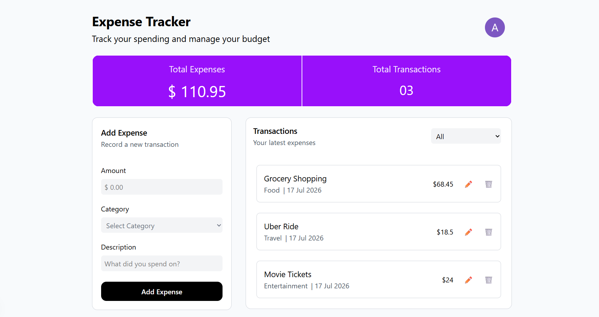
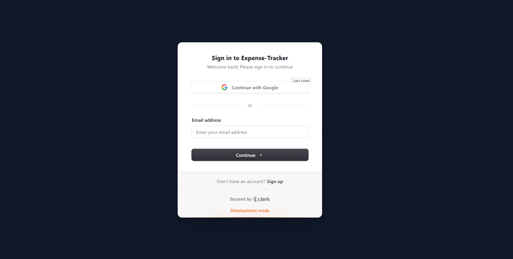

# Expense Tracker

A full-stack expense tracking application built with **Next.js**, **TypeScript**, **Prisma ORM**, **PostgreSQL**, and **Clerk Authentication**.

I built this project to learn how authentication works in a real application and how to connect a React frontend with a database using Next.js API routes and Prisma. Unlike my previous project, this one stores user-specific data, meaning every user can only access and manage their own expenses.

Along the way, I also got to work with loading states, form validation, CRUD operations, and organizing a slightly larger codebase.

---

## Features

* 🔐 User authentication with Clerk
* 👤 User-specific expense management
* ➕ Add new expenses
* ✏️ Edit existing expenses
* 🗑️ Delete expenses
* 📂 Filter expenses by category
* 💰 Automatically calculate total expenses
* 📅 Display transaction dates
* ⏳ Loading and saving states
* 📱 Responsive layout

---

## Tech Stack

### Frontend

* Next.js 16 (App Router)
* React 19
* TypeScript
* Tailwind CSS v4

### Backend

* Next.js Route Handlers
* Prisma ORM
* PostgreSQL (Neon)
* Clerk Authentication

---

## Screenshots

### Dashboard



### Sign In



---

## Getting Started

### 1. Clone the repository

```bash
git clone https://github.com/arpit-cyber-ops/Expense-Tracker.git
cd Expense-Tracker
```

### 2. Install dependencies

```bash
npm install
```

### 3. Create a `.env` file

```env
DATABASE_URL=

NEXT_PUBLIC_CLERK_PUBLISHABLE_KEY=
CLERK_SECRET_KEY=
```

### 4. Run the database migrations

```bash
npx prisma migrate dev
```

### 5. Start the development server

```bash
npm run dev
```

---

## What I Learned

Some of the things I learned while building this project:

* The difference between authentication and authorization
* How to protect API routes using Clerk
* Storing and retrieving user-specific data with Prisma
* Building CRUD APIs using Next.js Route Handlers
* Managing state across multiple React components
* Working with PostgreSQL in a full-stack application
* Improving the overall structure of a larger React project compared to my first project

This project also taught me that building a feature is only one part of development. Thinking about component structure, user experience, and keeping the code organized became much more important as the project grew.

---

## License

This project is licensed under the MIT License.
